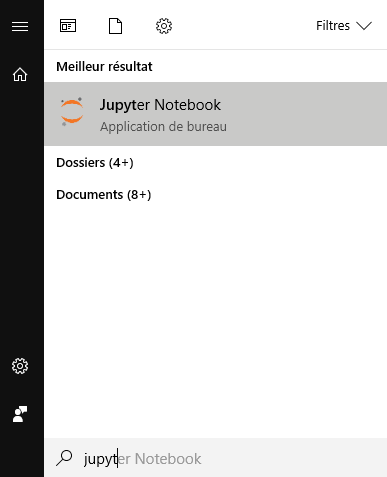
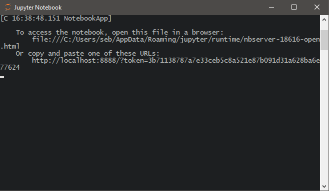
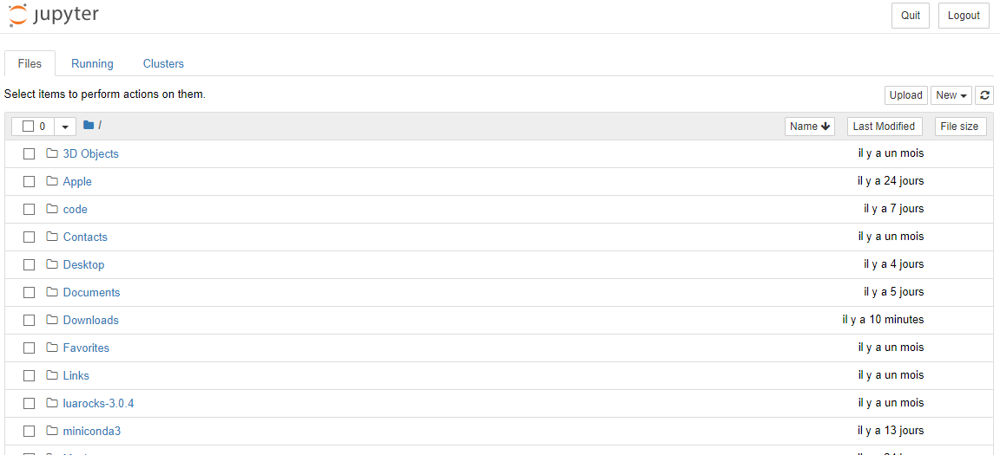
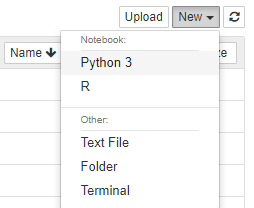
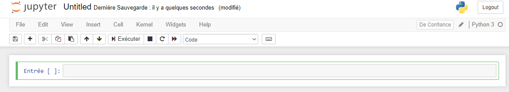

# SGZurichPython2019
Extra material for SG Zurich Python courses (2019)

## Install Python
**Please visit [Anaconda](https://www.anaconda.com/distribution/)**
- Select Windows or MacOS
- Click download for **Python 3.7 version**
- Save it (.exe or .dmg), it's ~ 600 megs
- Launch the installer (.exe or .dmg)
- Follow the steps (not need to change the defaults) and install.

A `Anaconda` folder should be created, either in the start menu (Windows) or the app launcher (MacOS). In that folder you should see a **Jupyter Notebook** application with the following icon :


If not found: please type "Jupyter" right after opening the Windows start menu / or in MacOS finder:


It will launch a new window (text based console application), and it will open a link in your default web browser (Chrome, safari, Firefox or Edge are fine), the [Jupyter notebook file browser](http://localhost:8888/tree)

**Do not close that window:**



We will work in the web browser from here, it's a web based file browser, usually you can see your home folder, and manage notebooks/folders from here :



Next, create a new notebook : 



It will open a new tab in the current web browser (and create a notebook file in your home folder), with the following content (here in french):




Nice ! Now try some coding, type :
```python
2+2
```

And hit `Shift` + `Enter` to execute.

Wow !


